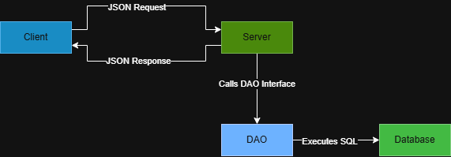
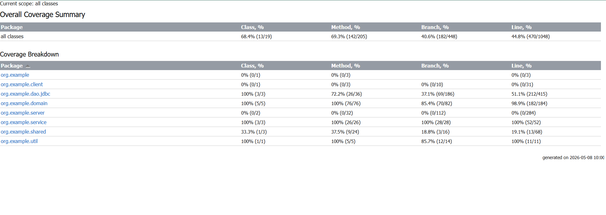

---
### README
### Project Overview, setup, protocol
### COMP C8Z03 Object-Oriented Programming (stage 2 {group project})
---
# RecipeHub — GCA2 Project 📖
## 1 Project Overview: 
This system would allow users to create, and manage recipes composed of different ingredients etc. Each food (ingredient) will store the nutritional information , the subsequent macros such as calories , carbohydrates, protein, fats. When an ingredient is added to a recipe, the system will automatically calculate and display the total macro values for the entire finished recipe , based off included ingredients. The user will also be able to favourite recipes, either that they created or that someone else created, users will get the option to make their recipes public or private, public meaning other users on the application will have access to their recipes.

## 1.1 The team
### GroupID: 2025-25-L8-OOP-GCA2-Group
Members
| Name                   | Student Number   |
|------------------------|------------------|
| Conor Murphy           | D00279403    |
| Conor McCracken        | D00280569 |
| Richie Orji            | D00280247 |

## 1.2 Key Features:
- CRUD (Create,Read,Update,Delete) operations for users,ingredients & recipes.
- JDBC DAO and interfaces.
- JSON serialisation & deserialisation entities.
- Multithreaded server using "implements Runnable".
- Filtering using Predicate<T>
- Binary file upload & binary file recievale (Stage 3)
- JUnit testing with full coverage report.

## 2 How to Run
---
Requires Java 17+
IntelliJ Idea (recommended)
MySQL Server (local)
Maven/Gradle
---

## 2.1 Database Setup
- Create a database eg. SampleDatabase
- Run the script 'sql/mysqlSetup.sql'
- Verify seed data; Each table must have a minimum of 10 rows

## 2.2 Configure credentials
Database credentials:
```
private static final String URL = "jdbc:mysql://localhost:3306/recipehub";
    private static final String USER = "root";
    private static final String PASS = "";
```

SQL located in sql/mysqlSetup.sql

## 2.3 Run the server
Run the server in server/server.java

Expected output: Starting on port: + port number. RecipeHub server has started.
                

Sample exceptions: (found in constructor)

```
if(port <1_024 || port > 65_535)
        {
            throw new IllegalArgumentException("Port must be between 1024 and 65535");
        }
        if(userDao == null)
        {
            throw new IllegalArgumentException("userDao must not be null");
        }
        if(recipeDao == null)
        {
            throw new IllegalArgumentException("recipeDao must not be null");
        }
        if(ingredientDao == null)
        {
            throw new IllegalArgumentException("ingredientDao must not be null");
        }
```
## 2.4 Run the client
Run client in client/client

Expected output: Connected to client in + host : + port.

Sample expections:
```
if(host == null || host.isBlank())
        {
            throw new IllegalArgumentException("Host must not be empty");
        }
        if(port <1_024 || port > 65_535)
        {
            throw new IllegalArgumentException("Port must be between 1024 and 65535");
        }
```

## 3 Architecture Summary 🏗️



This application features a mutlithreaded server meaning mulitple clients can run the program simutanously.

Client:
Handles client request to the server and user interaction.

Server:
Creates new threads and handles requests and sends response.

Service:
Contains validation and error handling so that invalid data isn't being passed into the JDBC DAO.

JDBC DAO:
The connection between java and sql. Handles all database access with queries.

Database:
Stores all RecipeHub data.

Json:
Used to serialise when sending data and deserialise when recieving data.
## Entities:
---
### User 👨‍🦲

The "user" entity represents each user that is on our application. A user can either be a user with limited permissions or an admin with all permissions.

| Field        | Type   | Description                          | Example  |
|--------------|--------|--------------------------------------|----------|
| id           | int    | Unique ID for each user              | 3        |
| username     | String | User’s display name                  | "alice"  |
| userType     | String | Role of user (admin or user)         | "admin"  |
| userRating   | double | Rating (0–5 scale)                   | 4.5      |

---

### Recipe 📘

The "recipe" entity represents each recipe that is in our database, the recipe shows details about the recipe and the user responsible for creating it, it also declares wheither the recipe is public or private. Public meaning other users can see it, private meaning that only the user who made it can see it.

| Field          | Type    | Description                          | Example                        |
|----------------|---------|--------------------------------------|--------------------------------|
| recipeId       | int     | Unique ID for each recipe            | 10                             |
| userId         | int     | ID of user who created it            | 2                              |
| recipeName     | String  | Name of recipe                       | "Chicken Stir Fry"             |
| categoryId     | int     | Category ID                          | 1                              |
| description    | String  | Short description                    | "Chicken, broccoli, rice"      |
| totalCalories  | double  | Total calories                       | 650                            |
| isPublic       | boolean | Whether recipe is public             | true                           |

---

### Ingredient 🍚
The "ingredient" entity represents each ingredient in our database. This entity shows relevant information for each ingredient that goes into a recipe.
All nutrional values are based on 100g servings
| Field         | Type   | Description                        | Example            |
|---------------|--------|------------------------------------|--------------------|
| ingredientId  | int    | Unique ID for each ingredient      | 7                  |
| name          | String | Ingredient name                    | "Chicken Breast"   |
| calories      | double | Calories per serving               | 165                |
| protein       | double | Protein per serving                | 31                 |
| carbs         | double | Carbs per serving                  | 0                  |
| fat           | double | Fat per serving                    | 3.6                |

---

## 🌳 Structure Tree of Application (to date)
```
─example
│   App.java
│   
├───client
│       Client.java
│       
├───dao
│   │   IngredientDao.java
│   │   RecipeDao.java
│   │   UserDao.java
│   │   
│   └───jdbc
│           JDBCIngredientDao.java
│           JDBCRecipeDao.java
│           JdbcUserDao.java
│           
├───domain
│       FileUploadPayload.java
│       Ingredient.java
│       Recipe.java
│       RecipeImageData.java
│       User.java
│       
├───server
│       ClientHandler.java
│       Server.java
│       
├───service
│       IngredientService.java
│       RecipeService.java
│       UserService.java
│       
├───shared
│       ClientRequest.java
│       RequestType.java
│       ServerResponse.java
│       
└───util
JsonUtil.java
```

## JSON Protocol (summary) 

### Request format ⬅️
```json
{ "requestType": "<TYPE>", "payload": { ... } }
```

### Response format ➡️
```json
{ "status": "SUCESS|ERROR", "message": "...", "data": ... }
```


---

## Request Types :clipboard:

| requestType | Purpose |
| :- | :- |
| USER_GET_ALL | Get all users |
| USER_GET_BY_ID | Get user by id |
| USER_INSERT | Insert user |
| USER_UPDATE | Update user |
| USER_DELETE | Delete user |
| USER_FILTER | Filter users |
| RECIPE_GET_ALL | Get all recipes |
| RECIPE_GET_BY_ID | Get recipe by id |
| RECIPE_INSERT | Insert recipe |
| RECIPE_UPDATE | Update recipe |
| RECIPE_DELETE | Delete recipe |
| RECIPE_FILTER | Filter recipes |
| INGREDIENT_GET_ALL | Get all ingredients |
| INGREDIENT_GET_BY_ID | Get ingredient by id |
| INGREDIENT_INSERT | Insert ingredient |
| INGREDIENT_UPDATE | Update ingredient |
| INGREDIENT_DELETE | Delete ingredient |
| INGREDIENT_FILTER | Filter ingredients |
---


### Generative AI (chatgpt)
- Used for field ideas and idea creation.
  All concepts where understood by all team members before implementation.
